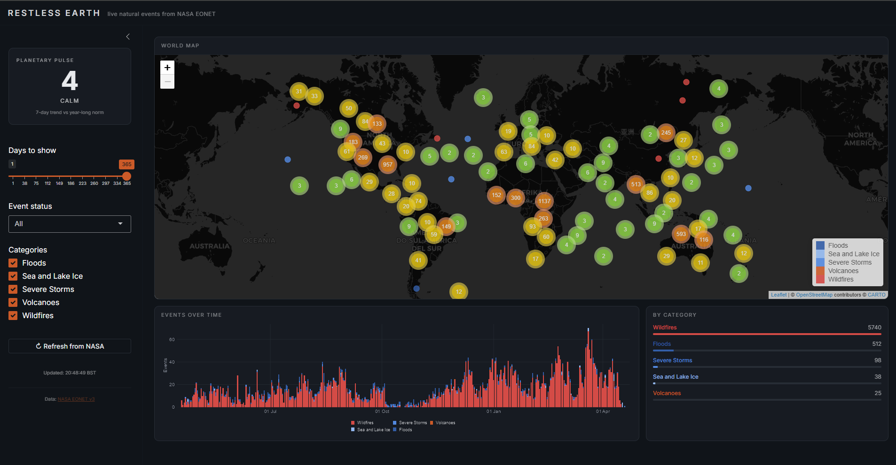

# Earth Event Tracker

Live natural events from NASA's [EONET](https://eonet.gsfc.nasa.gov) on an interactive world map, with a **Planetary Pulse Index** that tells you how busy Earth has been recently compared to the last year.



## What you get

-   **World map** with every natural event (wildfires, storms, volcanoes, floods, ice, landslides, more) pinned at its location, colour-coded by category, clustered when zoomed out. Click any marker for details and a source link.
-   **Planetary Pulse Index** in the sidebar: a single number where 100 is an average week, 140 means 40% busier than average, 75 means 25% quieter.
-   **Filters** for category, time window (1 to 365 days), event status (open / closed / all), and a slider to set the pulse's recent window (7 to 63 days, in weekly steps).
-   **Timeline** stacked by category so you can see which hazards are driving the activity.
-   **Category breakdown** with a mini bar chart.
  
## Requirements

-   R 4.1 or newer (needs the native `|>` pipe)
-   An internet connection (to hit EONET and load Google Fonts)

## Run it

From the project root:

``` r
# 1. Install deps (one time)
source("install.R")

# 2. Launch
shiny::runApp()
```

Or from your shell:

``` bash
Rscript -e 'source("install.R"); shiny::runApp()'
```

Browser opens automatically at `http://127.0.0.1:XXXX`.

## Project layout

```         
eonet-map/
├── app.R               # UI + server
├── R/
│   ├── api.R           # EONET fetcher + 10-min cache
│   ├── index.R         # Planetary Pulse calculation
│   └── ui_helpers.R    # Category colors
├── install.R           # One-shot dep install
└── README.md
```

Everything in `R/` auto-sources when Shiny starts, so you never need to manually `source()` anything.

## How the Planetary Pulse Index works

The idea: compare the last N days of activity to the last year, and express the recent stretch as a percentage of the yearly average. N is yours to choose via the "Pulse: recent window" slider (default 7).

```         
1. Weight each event by category     (storms = 1.2, wildfires = 1.0, dust = 0.5, etc.)
2. Sum weighted events per day        -> daily activity score for every day in the last year
3. Take the mean of the last N days   -> recent
4. Take the mean of all 365 days      -> yearly average
5. Pulse = round((recent / yearly average) * 100)
```

So pulse 140 = 40% busier than a typical week. Pulse 75 = 25% quieter. Pulse 100 = average.

Pick your window based on what you want to see:

-   **7 to 14 days** — reactive, catches short bursts (a hurricane week, a volcano kicking off)
-   **21 to 28 days** — smoother, good balance of signal vs noise
-   **35 to 63 days** — seasonal trend, only shifts when something structural is happening

Verdict bands:

| Pulse   | Verdict       | Meaning                         |
|---------|---------------|---------------------------------|
| 140+    | very restless | 40%+ busier than yearly average |
| 120–139 | restless      | 20–40% busier                   |
| 80–119  | normal        | within ±20% of average          |
| 60–79   | quiet         | 20–40% below average            |
| \<60    | calm          | more than 40% below average     |

Weights live in `R/index.R` under `CATEGORY_WEIGHTS`.
